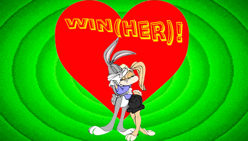
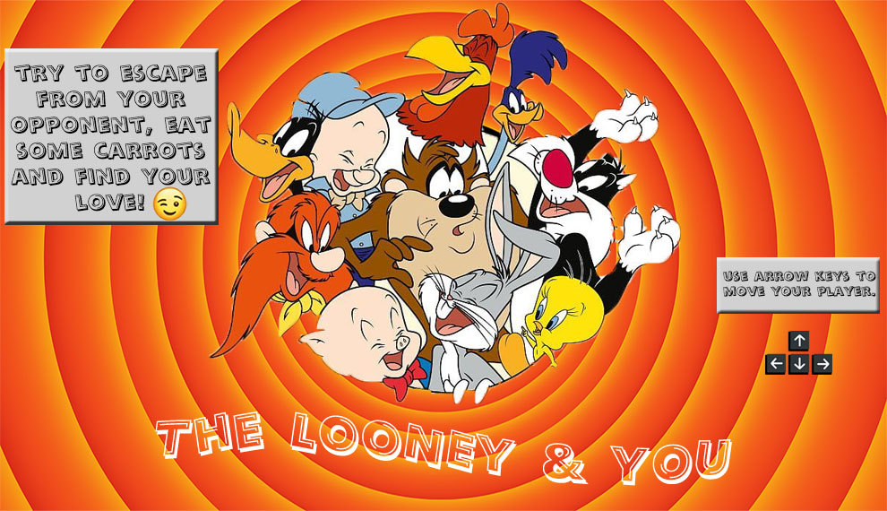
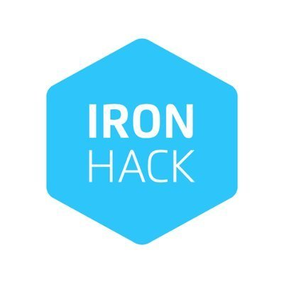

 

<h1 align="center" dir="auto"><strong>The Looney & You!</strong></h1>
 
 
<h3><strong>Introduction:</strong></h3>
<ul>
<li><em>The Looney & You! Game</em>, is a game to bring to the grown-ups the childhood memories, of the hours spent playing GameBoy and watching the adventures of LooneyTunes on TV.</li></ul>
 
<h3><strong>About:</strong></h3>
<ul>
<li>This is the result of my first <em><strong>Ironhack</strong> Web Development</em> course project.</li>
<li>The game consists of bugs bunny managing to escape the hunter, avoid obstacles and find his bunny.</li>
<li>In the future i want to improve the game and maybe make more levels and make it more interesting!</li>
</ul>
 
<h3><strong>Difficulties:</strong></h3>
<ul>
<li>The challenges were many, there were 3 intense weeks of study and stress, but with the knowledge acquired in the bootcamp, i managed to develop my first game.</li>
<li>I had a lot of support and help from my colleagues and teachers to get it done.</li>
<li>The steps were many! The idea was the easiest part, then came the hard parts, the design concept, the organization of the folders and files, and of course the code.</li>
</ul>
 
 
 
<h1 align="center" dir="auto">
<a rel="noopener noreferrer" href="https://adrianaleitao.github.io/The-Looney-You/" target="_blank"><strong>TRY ME!...if you want ;)</strong></a></h1>
 
 

 
<h3><strong>Controls:</strong></h3>
<table>
<thead>
<tr style="border: 1px solid black;">
<th style="border: 1px solid black;">Key</th>
<th style="border: 1px solid black;">Action</th>
</tr>
</thead>
<tbody style="border: 1px solid black;">
<tr style="border: 1px solid black;">
<td style="border: 1px solid black;"><strong><code>Arrows</code></strong></td>
<td style="border: 1px solid black;">Use the Arrows to move the player!</td>
</tr>
</tbody>
</table>
 
 
<h3><strong>In the future:</strong></h3>
<ul>
<li>Make more villains.</li>
<li>Add more levels.</li>
<li>Make it responsive.</li>
<li>Add more obstacles.</li>
<li>Improve sound effects.</li>
</ul>
 
 
